## USER STORIES
## Technologies Used
Full stack application using Express, Node.js, Bootstrap and LESS.  
Google Fonts and Material.io for styling. 
Balsalmiq wire framing and Trello for organizing workflow.  

## Approach Taken
We sought to create a music event sharing app for musicians to share information about upcoming gigs.  

Initial capabilities are a user profile. From here, users can register as an "artist". Once an artist profile has been created, events can be created and members can be added to artist profile. 

Events, artists and users can all be browsed on separate index pages, where a profile picture and name are displayed. To view more information about another user, an artist or an event, a user must be logged in or register.  

Our models include: Artist, User and Event.  

Views include index, show, edit and new for each model.  

Our app also includes an auth view as a landing page where a user can log in or register and a carousel displays current users, artists and events at random.  

## Unsolved problems and future possibilities
An ability to add or remove artists from an event.  
Search and sort functionality with a search bar and filters.  

## SCREENSHOTS
Landing Page:

Login Modal:
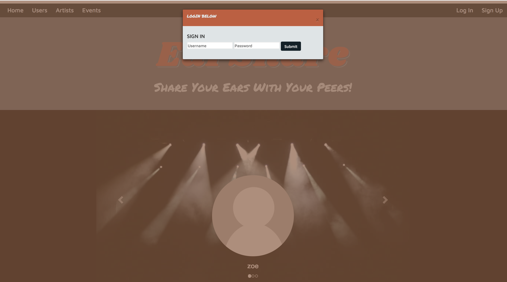

Index (Events):
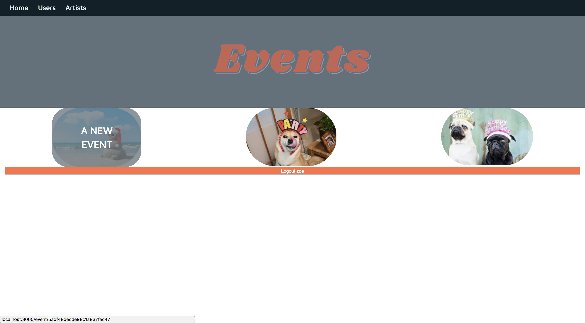

Show (Artist):
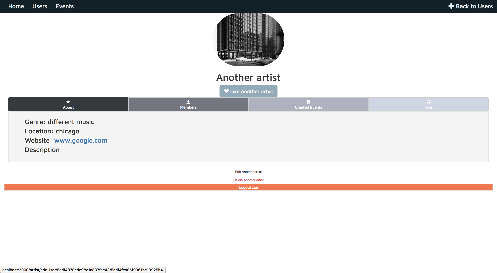

Show (Adding User to Artist):
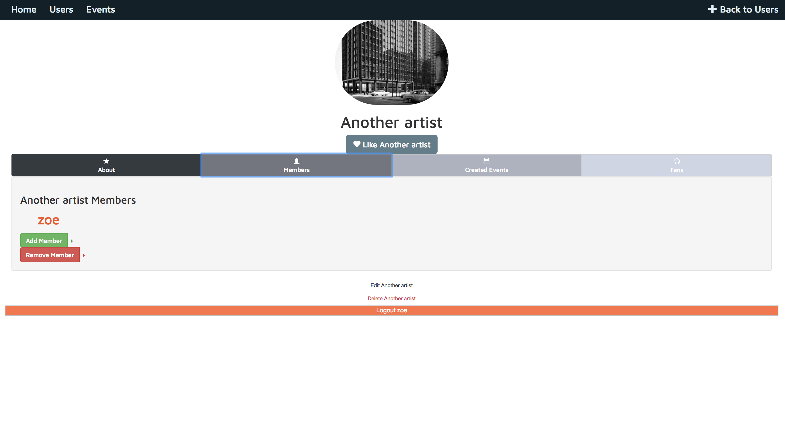

New (Artist):
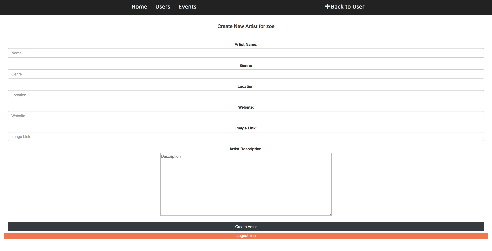

Logout Message:
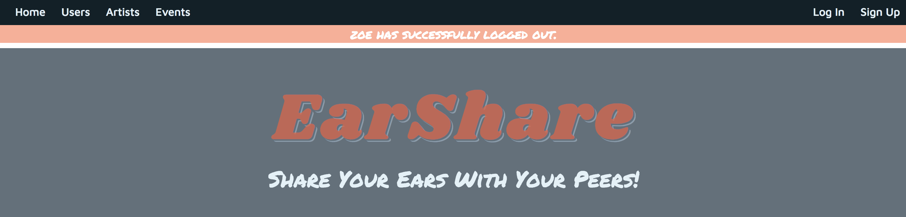

### MVP

Artist:  
-- params: name (required), password, location, genre, description, members, website link, photo  
-- Artist will be able to create, delete, and edit events  
-- Artist will be able to invite users to have access to the artist page  
-- Index: a list of all events they've created, button to create event, edit artist details  
-- Show: Details of the event, along with an edit and delete button  
-- Edit: Be able to edit Artist info  

Event:  
-- params: date, time, location, description, cost, other artists performing, how many people attending, photo  
-- Index: a list of all events  
-- Show: Details of an event to learn more about it  
-- Edit: Be able to Edit Event Info  
-- New: Create a new event  

User:  
-- params: username, password, location  
-- be able to view event index  
-- be able to like it  
-- mark if they're attending or interested in going  
-- User will be able to become an artist  
-- Index: toggle between a list of events and artists (later, include a search/filter function), will be able to register as an artist  
-- Show: A list of events they've interacted with  
-- Edit: Be able to change the user information if they want  

User registration:  
-- User creates a username, password, registers an email  
-- User gets redirected to the user index  

## Wireframes

Landing Page:
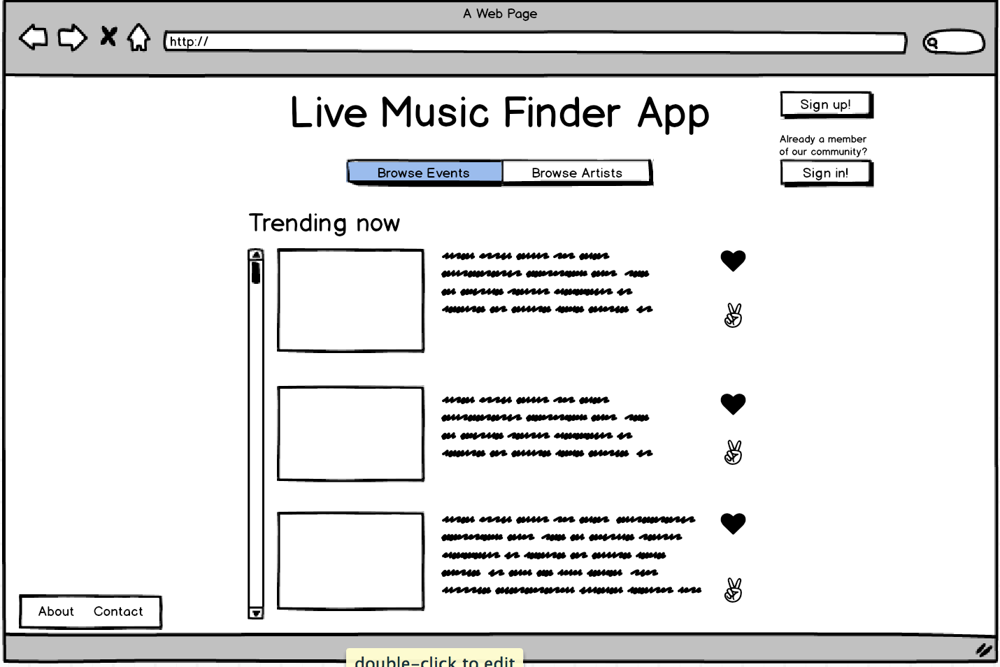

User Registration:
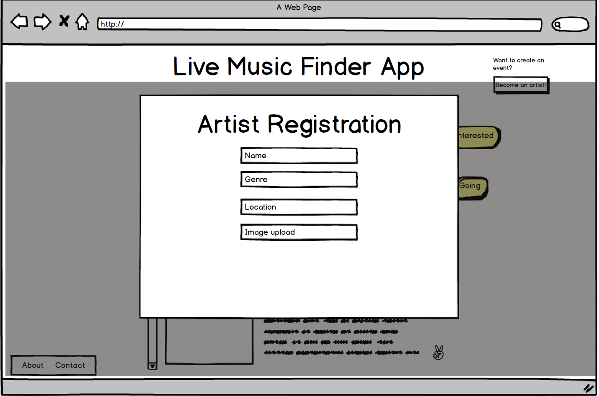

User Login:
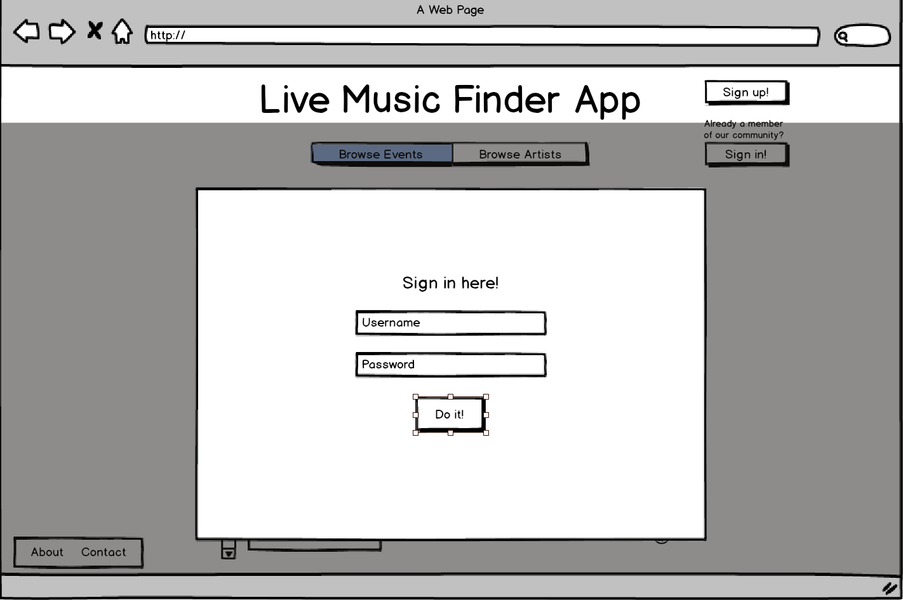

User Index:
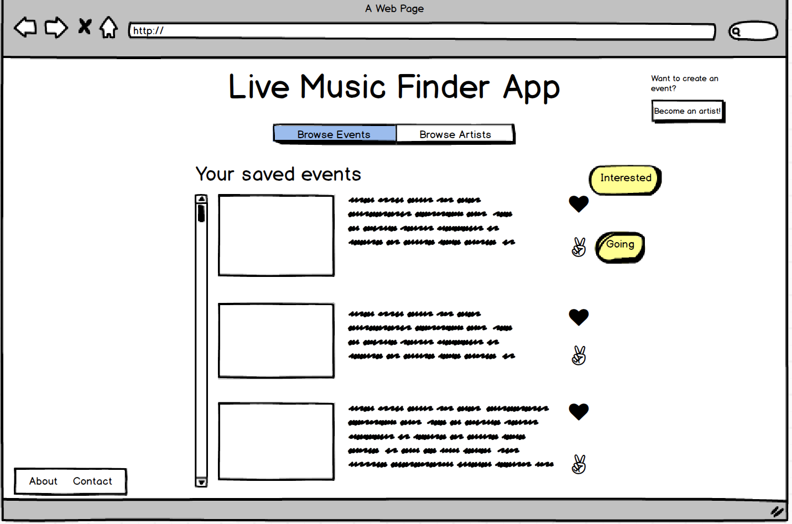

Artist Registration:

Artist Index:

Artist Create Event:
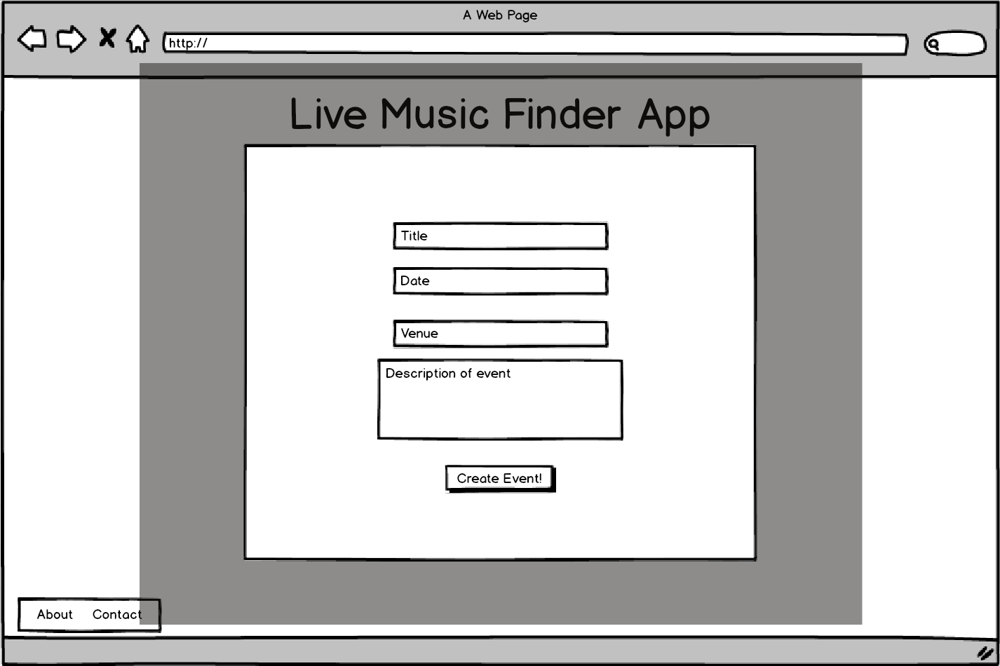

Artist Invite User:
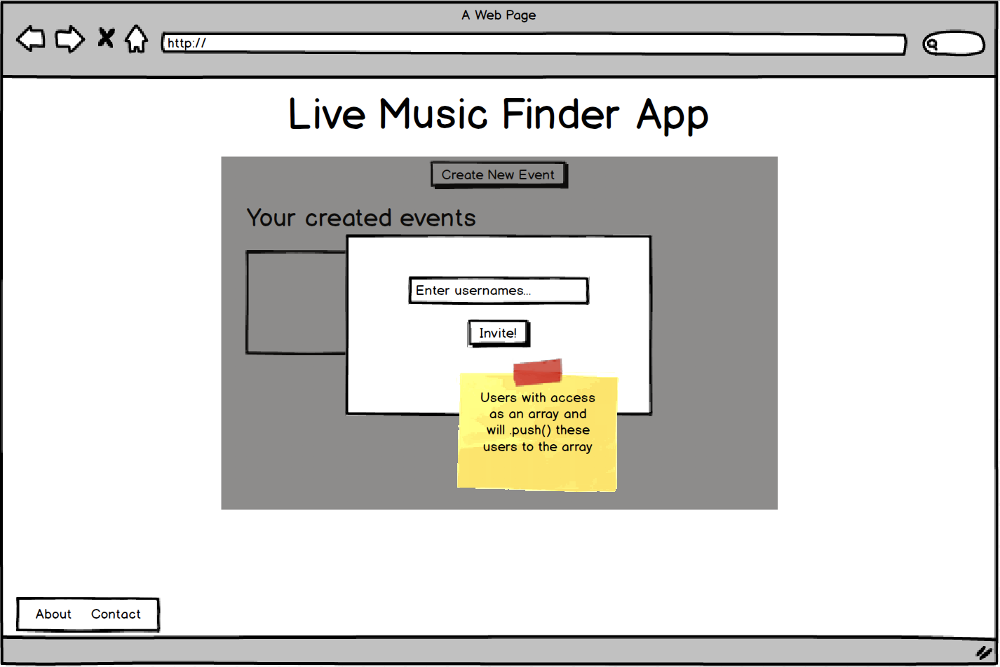

Artist Edit Event:
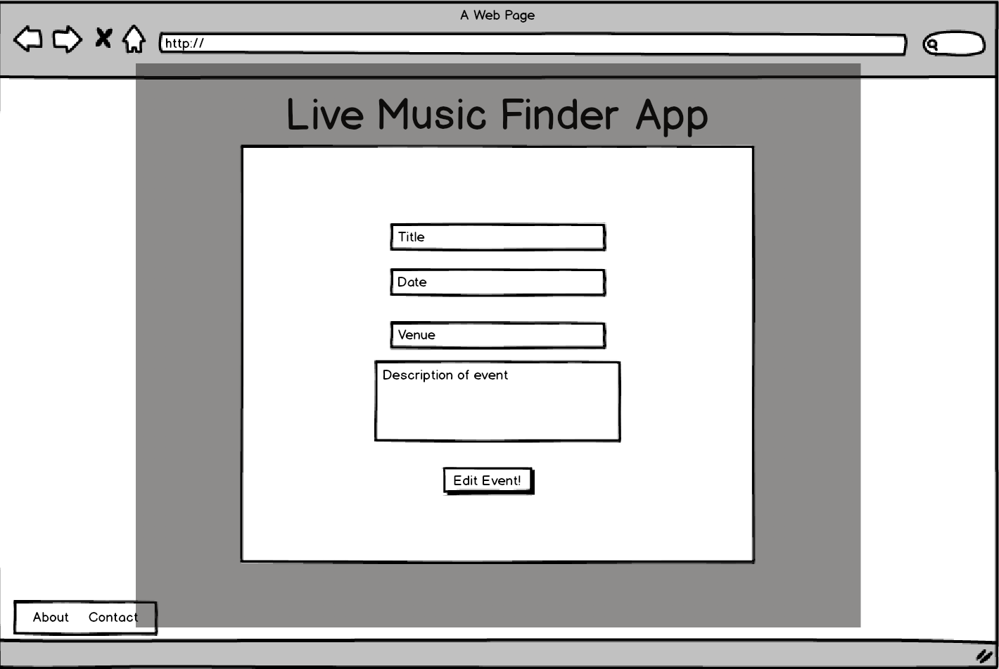

Event Index:
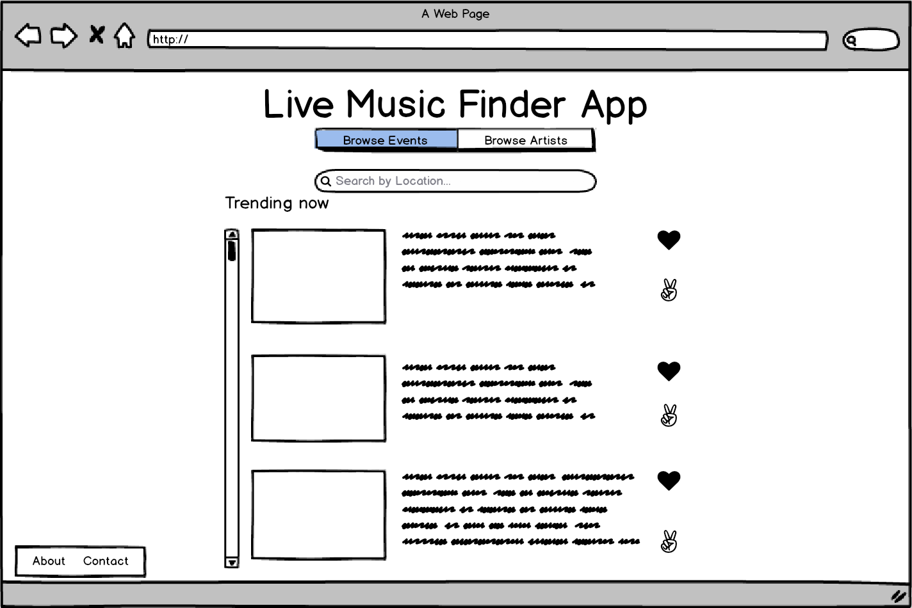

Event By Location:
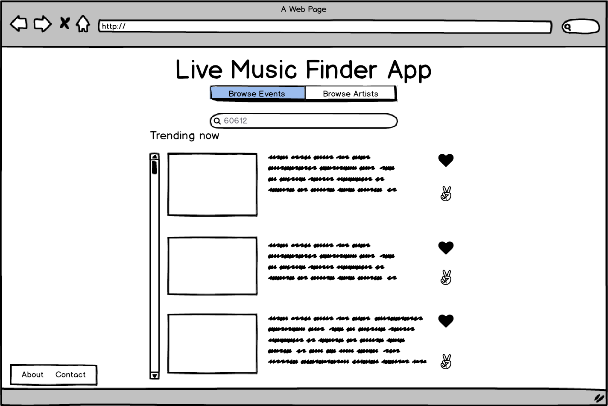
