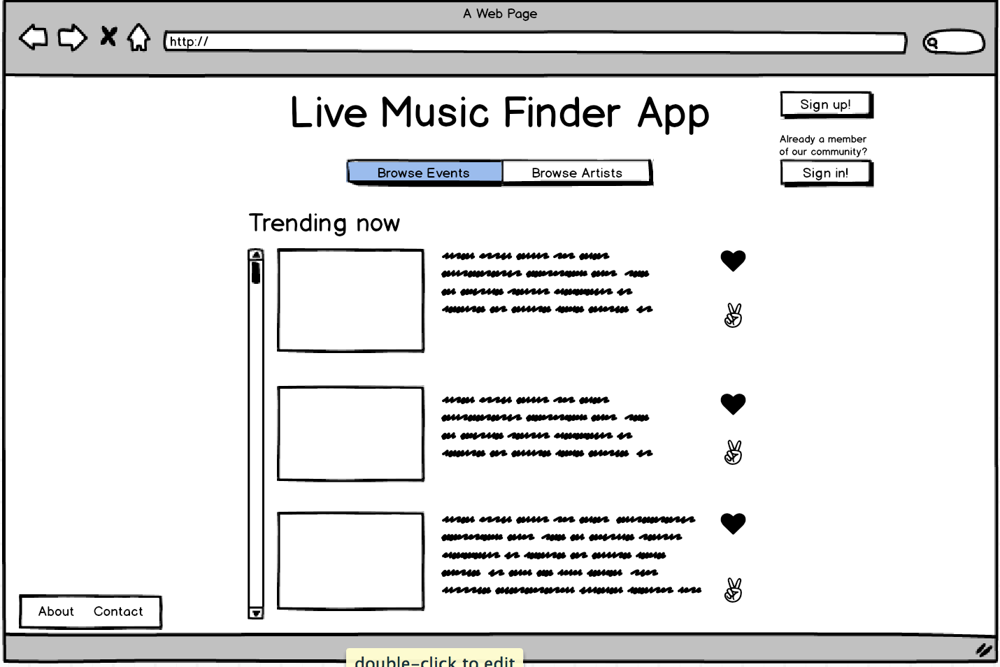
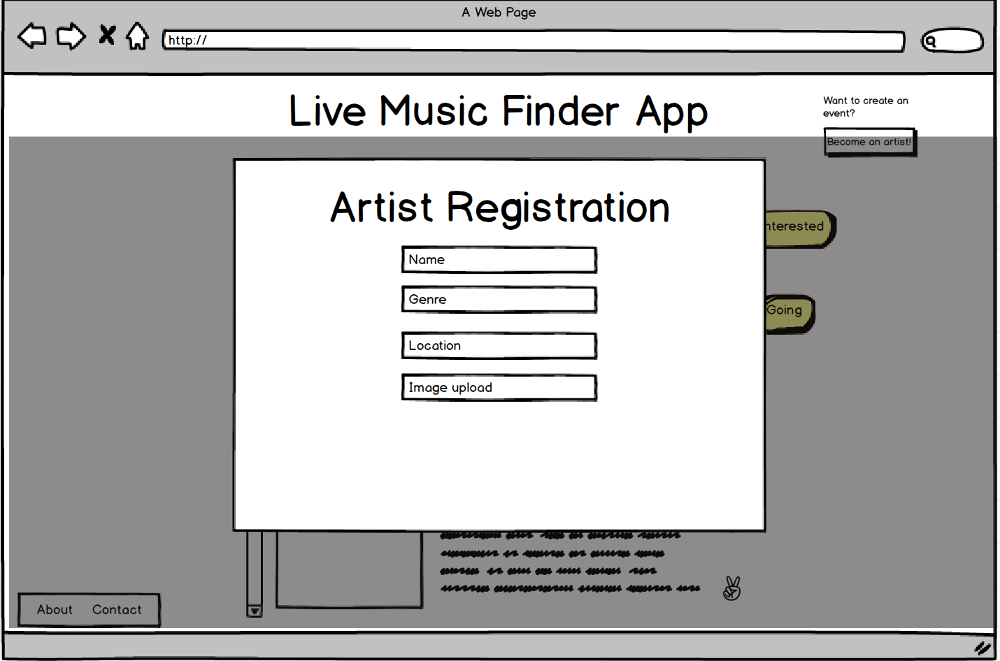
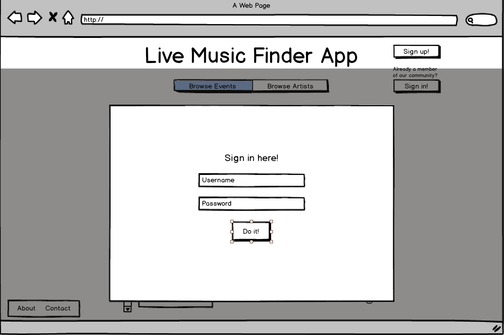
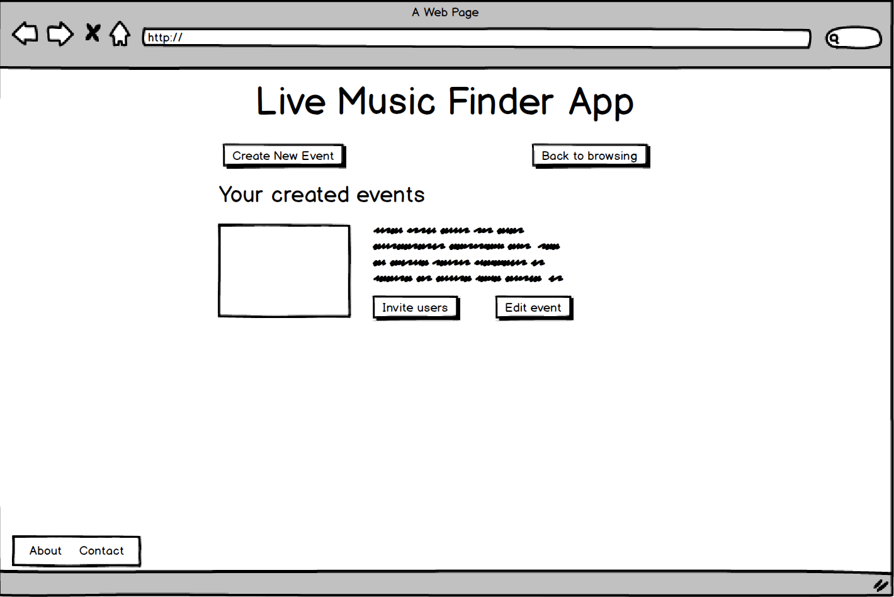
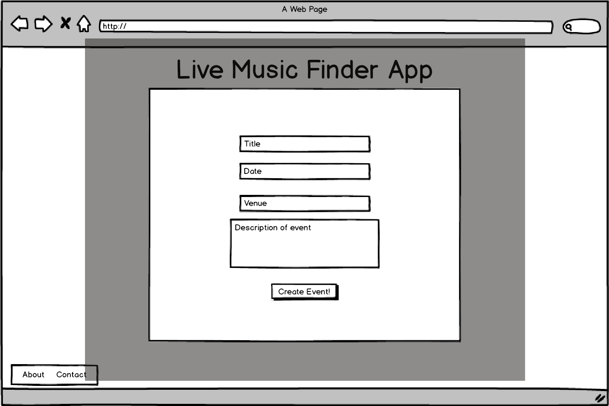
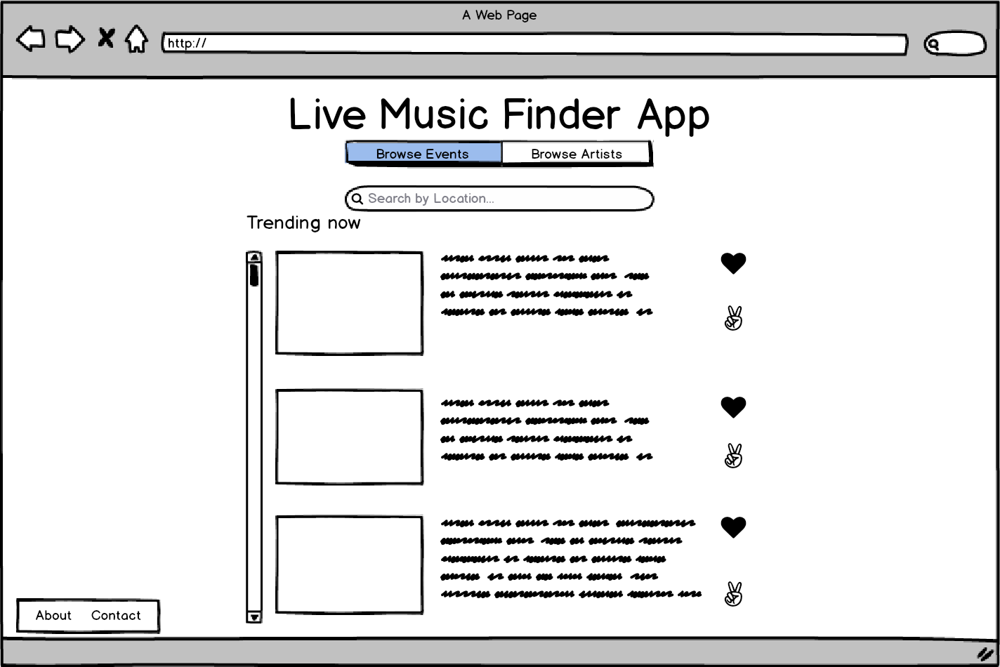

## User Story

Three Models: Artist, User, and Event.

Artist - a musician or band that wants to post an event to spread awareness and invite attendees.

User - people who go to the events

Events - concerts/shows/sets/etc.

### MVP

Artist:  
-- params: name (required), password, location, genre, description, members, website link, photo  
-- Artist will be able to create, delete, and edit events  
-- Artist will be able to invite users to have access to the artist page  
-- Index: a list of all events they've created, button to create event, edit artist details  
-- Show: Details of the event, along with an edit and delete button  
-- Edit: Be able to edit Artist info  

Event:  
-- params: date, time, location, description, cost, other artists performing, how many people attending, photo  
-- Index: a list of all events  
-- Show: Details of an event to learn more about it  
-- Edit: Be able to Edit Event Info  
-- New: Create a new event  

User:  
-- params: username, password, location  
-- be able to view event index  
-- be able to like it  
-- mark if they're attending or interested in going  
-- User will be able to become an artist  
-- Index: toggle between a list of events and artists (later, include a search/filter function), will be able to register as an artist  
-- Show: A list of events they've interacted with  
-- Edit: Be able to change the user information if they want  

User registration:  
-- User creates a username, password, registers an email  
-- User gets redirected to the user index  

## Wireframes

Landing Page:

User Registration:

User Login:

User Index:

Artist Registration:

Artist Index:

Artist Create Event:

Artist Invite User:

Artist Edit Event:

Event Index:

Event By Location:

